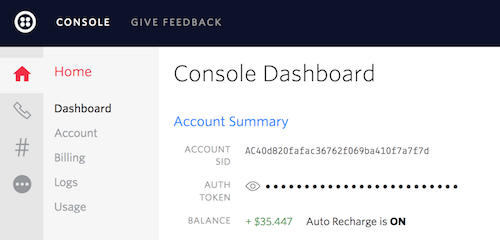
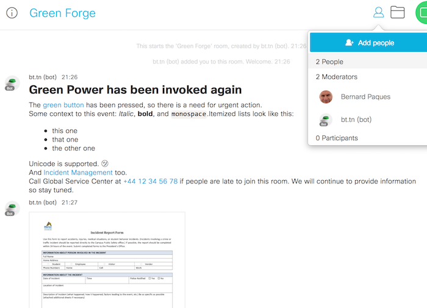

# How to install the full system?

While the architecture is made of multiple components, each of them is rather simple to put in place.
There is absolutely no need to be a software developer, just follow instructions below.

If you are a Dimension Data employee, then you can benefit from the back-end that has been put in place for the project. Acquire a connected button and contact the Green Force group in Yammer. In other terms, you only have to do step 1, and can delegate other steps to a colleague.

## Step 1. Get a physical button that can generate web requests.

If you prepare a demonstration of the Green Button, then you can go with a WiFi version, and pair it with your smartphone during the initial setup of the button. This will provide the button with connectivity to the Internet wherever you are. You should switch the button off most of the time, so that batteries are preserved as much as possible.

For a fixed deployment you may consider a connectivity option that is better adapted to the Internet of Things (IoT). For example select a button that support GPRS, and add a SIM card from any cheap provider of data services. Also, across Europe some countries have Sigfox networks. Last but not least, you can connect a WiFi button to the network of your client, yet this is a bit more intrusive than other options.


Based on our experience, here are some important factors that you should consider:

* Any device that can invoke a web address is supported. It can be a physical button like those from bt.tn. It can be an application running on a mobile phone. It can be an Arduino or Raspberry Pi board in a custom setup. It can be a web hook triggered from Workday, Salesforce, or another cloud application. So you have the choice, really.

* No button is eternal. Energy is limited by the capacity of batteries. Connectivity over GPRS or Sigfow is pre-paid for some months. And 2 years after the initial acquisition of a button, bt.tn is asking for a monthly fee for continuous support. So keep these in mind before offering a "permanent" button to a business partner.

So, at the end of the day the Green Button project supports a wide variety of options. For a quick start we recommend the plug-and-play green buttons from [bt.tn](https://bt.tn). They have 2 different sizes, choice of colors, and multiple connectivity options.

## Step 2. Declare a bot at Cisco Spark for Developer, then save the precious token that is given in return.

Cisco is using Single-Sign On for all of their sites, then there is an extra registration step at [Cisco Spark for Developers](https://developer.ciscospark.com/). Once you are there, add a new application and provide required information, essentially, a name and an image. The site will give a token in return, that uniquely identifies your bot. Save this token as `CISCO_SPARK_BTTN_BOT` in the environment of your workstation.


## Step 3. Get credentials from Twilio.

Go to [Twilio](https://www.twilio.com) and create an account there. From there you will get enough funding to play a bit with the service and call your own phone number. For a serious service you will add credits and your account will be upgraded, so that you can call any number.

From the Twilio console you will reserve a public phone number, that will be the origin of calls given by the bot. You will also fetch your account SID and an authentication token, that should be saved as `TWILIO_ACCOUNT_SID` and `TWILIO_AUTH_TOKEN` respectively.



## Step 4. Get and configure a public web server.

If you have to go the manual way, then first secure a Ubuntu machine and consider following steps:

```bash
$ sudo apt-get install -y ntp git python-pip
$ cd /home/ubuntu/
$ git clone https://github.com/bernard357/bt.tn-spark.git
$ cd bt.tn-spark/
$ pip install -r requirements.txt
$ export CISCO_SPARK_BTTN_BOT="<whatever_your_spark_token_is>"
$ export TWILIO_ACCOUNT_SID="<account_sid_from_twilio>"
$ export TWILIO_AUTH_TOKEN="<auth-token_from_twilio>"
$ export BTTN_URL="<public_url_for_this_server>"
$ python tokens.py
$ python hook.py
```

The first python command will list security tokens, if any. The second command will run the server
and display log messages.

As a quick alternative, if you have some MCP credentials you may want to clone this GitHub
repository on your workstation, and then run plumbery:

```bash
$ git clone https://github.com/bernard357/bt.tn-spark.git
$ cd bt.tn-spark/
$ python -m plumbery fittings.yaml deploy
```

This will create a virtual server on a MCP and configure it appropriately:


Right after the setup of the server you may test the web service. From a web browser,
type a web link with the public IP address of the server, and the suffix `/ping`.
For example, if the bot runs on a server that has been given the address `168.123.45.67`, the test link would be:

`http://168.123.45.67/ping`

The browser should display `pong` as a successful response from the server.


## Step 5. Review button configurations.

Configuration files coming with the Green Button project will not work out of the box.
At least parameters related to Cisco Spark and to Twilio have to be changed.

In `buttons/incident.yaml` you should clear the list of `moderators` and put your own
e-mail address. Else you will not be invited to the Cisco Spark room created by the button.

In `settings.yaml` you should change the parameter `customer_service_number` and put there
the origin phone number used by twilio to send SMS and to call people.

That's all you need for a dry run. Of course, there are many other [configuration options](configuration.md), but these can be considered at a later stage.

## Step 6. Connect the button to the bot.

As a general principle, the button will trigger a pre-defined web link to activate the bot.
This link consists of the name or the public IP address of the bot, followed by a token specific to the button.

For example, if the bot runs on a server that has been given the address `168.123.45.67`, the prefix would be:

`http://168.123.45.67`

The token is usually the unique security token that has been associated with the button. You can find it by connecting over SSH to the server and asking for the list of tokens, for example:

```bash
$ python tokens.py
incident: aW5jaWRlbnQ6WHFUWXBoc0tvV2toMkdTM1dQTHpIZz09
incident-call: aW5jaWRlbnQtY2FsbDpuQmNETks2a1I3NnpITGNRQ1pKNGpRPT0=
incident-delete: aW5jaWRlbnQtZGVsZXRlOldWSGk4anBsZ1ZUUlhFSDVHejJrMUE9PQ==
request: cmVxdWVzdDpGT2krUDJpM0lJY0hEbFYxZ2R6UGZ3PT0=
request-call: cmVxdWVzdC1jYWxsOlFwZkpqNVFvbTNjemVmOU8zaU5DWlE9PQ==
request-delete: cmVxdWVzdC1kZWxldGU6L292TlJRZTJaNmIxcW4rUEZLS1lpUT09
```

So here the full link for the button `incident` would be:

`http://168.123.45.67/aW5jaWRlbnQ6WHFUWXBoc0tvV2toMkdTM1dQTHpIZz09`

And the link for the button `request` would be:

`http://168.123.45.67/cmVxdWVzdDpGT2krUDJpM0lJY0hEbFYxZ2R6UGZ3PT0=`

If no private `key` has been set in `settings.yaml` then no security token is required:

```bash
$ python tokens.py
Add a secret key to settings.yaml if you want security
No security token has been generated
```

In that case the full link for the button `incident` would be:

`http://168.123.45.67/incident`

And the link for the button `request` would be:

`http://168.123.45.67/request`

Please note that only security tokens protect your system against dictionary attacks. Without them you may experience spurious button pushes, or even the sudden destruction of your Cisco Spark rooms. You have been warned.

At this stage you have identified the web link that is associated with a configuration file. Now you can ask the actual button to use the link in case of push. If you have followed our recommendation, you would visit [my.bt.tn](http://my.bt.tn) and add an HTTP action to you registered button. This will take les than a minute.


## Step 7. Now launch Cisco Spark and press the button.

After some seconds you should get a new room on screen, and a first update in Markdown.
The button should return to quiet state (no led).



Congratulations! Hit the button again, to demonstrate how the bot can cleverly manage multiple states.

## What's next?

Now that the overall transmission chain is working, you may check [the configuration page](configuration.md) and adapt the behaviour of buttons to your specific needs.

If something goes wrong for some reason, then [the frequently questions page](questions.md) may help you to troubleshoot the issue and fix it.


