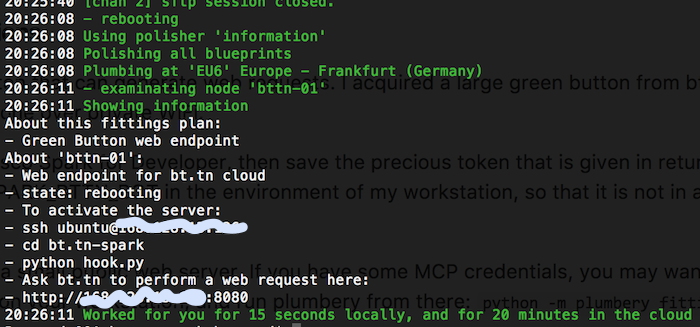
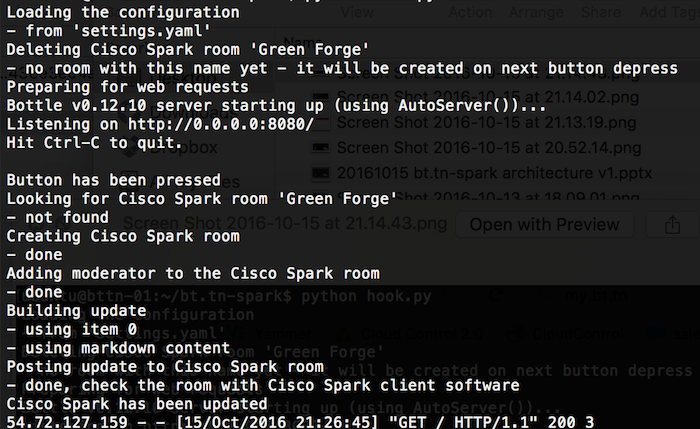
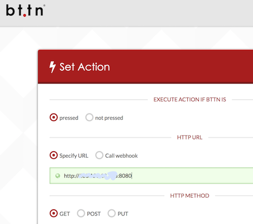
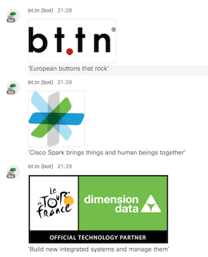

# How to install the full system?

While the architecture is made of multiple components, each of them is rather simple to put in place.
There is absolutely no need to be a software developer, just follow instructions below.

## Step 1. Get a physical button that can generate web requests.

I acquired a large green button from bt.tn,
and then paired it with my smartphone over private WiFi.


## Step 2. Declare a bot at Cisco Spark for Developer, then save the precious token that is given in return.

I saved this token as `CISCO_SPARK_BTTN_BOT` in the environment of my workstation, so that it is not in
any configuration file.


## Step 3. Get and configure a small public web server.

If you have to go the manual way, then first secure a Ubuntu machine and consider following steps.

```bash
$ sudo apt-get install -y ntp git python-pip
$ cd /home/ubuntu/
$ git clone https://github.com/bernard357/bt.tn-spark.git
$ cd bt.tn-spark/
$ pip install -r requirements.txt
$ export CISCO_SPARK_BTTN_BOT="<whatever_your_spark_token_is>"
$ export TWILIO_ACCOUNT_SID="<account_sid_from_twilio>"
$ export TWILIO_AUTH_TOKEN="<auth-token_from_twilio>"
$ export BTTN_URL="<public_url_for_this_server>"
$ python hook.py
```

Else if you have some MCP credentials, you may want to clone this GitHub
repository on your workstation, and then run plumbery: `python -m plumbery fittings.yaml deploy`



## Step 4. Activate the bot.

Connect to your server over SSH in a terminal window, then run the server in the foreground:
`python hook.py` Log messages are pretty comprehensive, so it should easy to monitor how things are going.



If you have used plumbery at the previous step, just follow instructions on screen.

## Step 5. Configure the button to use the public IP address of the web server.

For this I used the straightforward console provided by bt.tn. It took me about 1 minute or 2.




## Step 6. Now launch Cisco Spark and press the button.

After some seconds you should get a new room on screen, and a first update in Markdown.
The button should return to quiet state (no led), and the log of the server should report that everything is ok.


Congratulations! Hit the button again, to demonstrate how the bot can cleverly manage multiple states.

If you use `settings.yaml` out of the box, then on second push a SMS message will be sent, and on third push a phone call
will take place.



